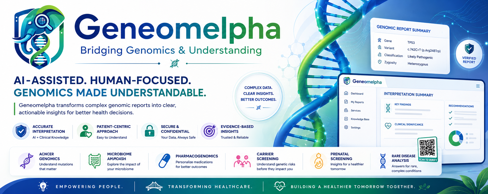
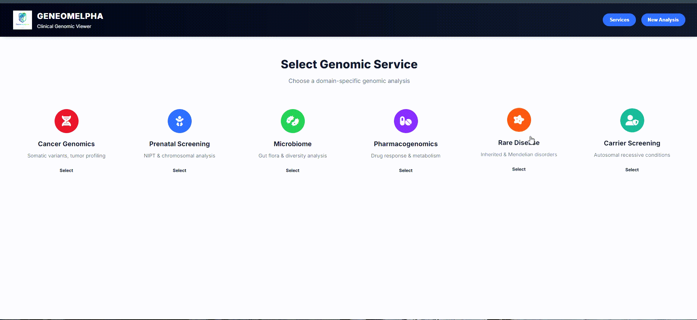
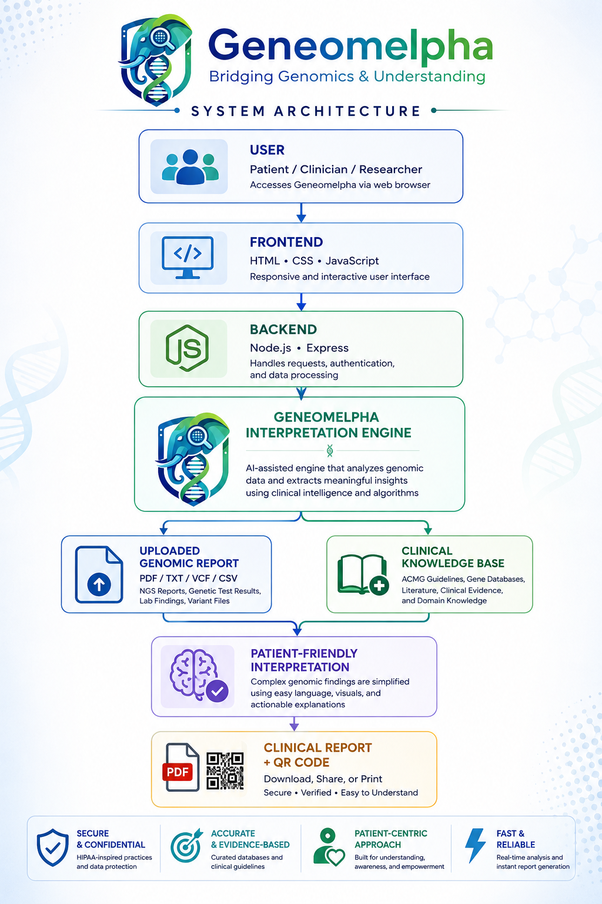
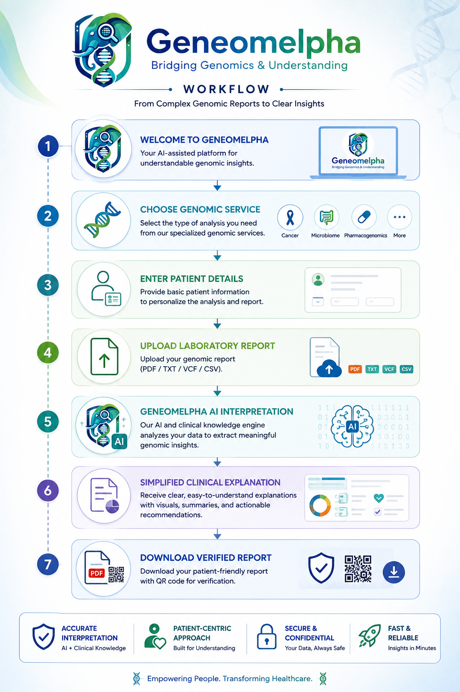
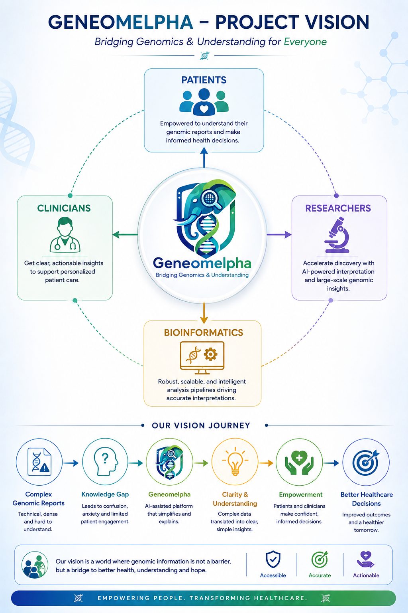
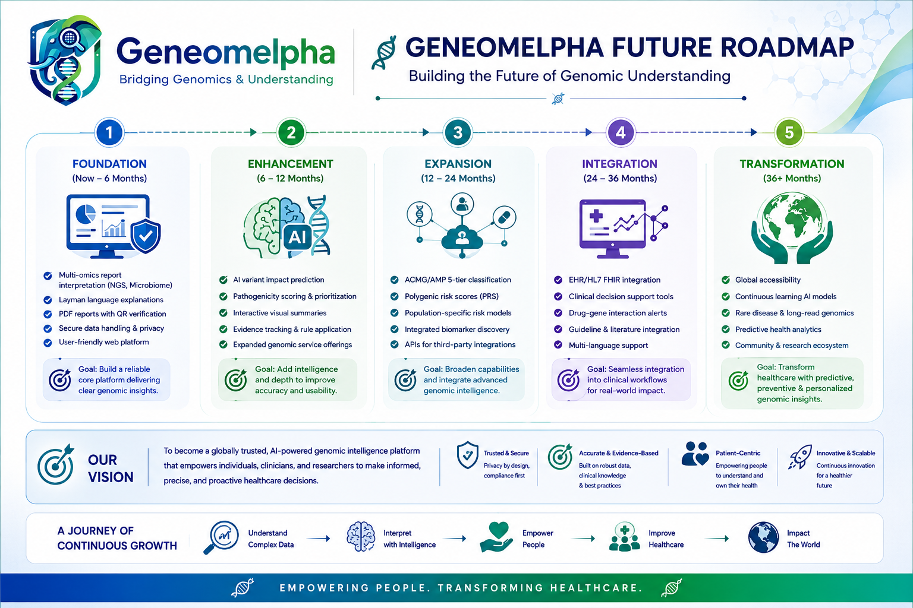

<p align="center">
  
</p>

<h1 align="center">🧬 Geneomelpha</h1>

<h3 align="center">
Bridging Genomics & Understanding
</h3>

<p align="center">
Making complex genomic reports understandable through bioinformatics, intuitive visualization, and human-centered design.
</p>

<p align="center">

<a href="https://genelpha.netlify.app/">

</a>


</p>

---

# 📖 About Geneomelpha

Geneomelpha is a **proof-of-concept bioinformatics platform** that explores how complex genomic reports can be transformed into **clear, patient-friendly, and clinically meaningful summaries**.

The project combines **computational genomics**, **clinical genomics**, **scientific communication**, and **human-centered interface design** to improve genomic literacy and make precision medicine more accessible.

Rather than replacing clinical expertise, Geneomelpha aims to support communication between laboratories, clinicians, researchers, students, and patients through intuitive genomic report interpretation.

---

# 💡 Why Geneomelpha?

Modern genomic sequencing technologies generate increasingly detailed reports, yet many remain difficult to interpret for people without formal genetics training.

Geneomelpha explores how bioinformatics and thoughtful interface design can bridge this communication gap by transforming complex genomic information into understandable visual summaries while preserving scientific meaning.

---

# 🌍 Live Demonstration

<p align="center">

### 🚀 Try Geneomelpha

## https://genelpha.netlify.app/

</p>

---

# 🎬 Interactive Platform Demonstration

The animation below provides a walkthrough of Geneomelpha's interface, demonstrating its workflow, genomic modules, and patient-oriented reporting.

<p align="center">

</p>

---

# ✨ Key Features

| Module | Description |
|----------|-------------|
| 🧬 Cancer Genomics | Simplified interpretation of cancer-associated genomic reports |
| 💊 Pharmacogenomics | Drug–gene interaction summaries |
| 👨‍👩‍👧 Carrier Screening | Accessible carrier screening reports |
| 👶 Prenatal Screening | Patient-friendly prenatal genomic interpretation |
| 🦠 Microbiome | Simplified microbiome report summaries |
| 🧬 Rare Disease | Easy-to-understand rare disease reports |
| 📄 Clinical Report Generation | Professional report generation |
| 🔐 QR Verification | Secure report authentication |
| 📊 Interactive Dashboard | Responsive modern interface |

---

# 🚦 Current Development Status

| Component | Status |
|-----------|:------:|
| Web Platform | ✅ Available |
| Documentation | ✅ Complete |
| Research Documentation | ✅ Complete |
| Live Demonstration | ✅ Available |
| AI-assisted Interpretation | 🚧 Planned |
| Clinical Validation | 🚧 Future Research |

---

# 👥 Who is Geneomelpha For?

| Audience | Purpose |
|----------|---------|
| 👤 Patients | Better understanding of genomic reports |
| 🩺 Clinicians | Improve patient communication |
| 🧬 Researchers | Demonstrate human-centered bioinformatics |
| 🎓 Students | Learn genomic interpretation |
| 🏥 Healthcare Organizations | Promote genomic literacy |

---

# 🏗 System Architecture

<p align="center">

</p>

Geneomelpha follows a modular architecture consisting of:

- 🎨 Frontend Interface
- ⚙ Backend Services
- 🧬 Geneomelpha Interpretation Engine
- 📄 Clinical Report Generation
- 🔐 QR Verification

📚 **Documentation:** [System Architecture](docs/architecture.md)

---

# 🔄 User Workflow

<p align="center">

</p>

```text
Choose Genomic Service
        │
        ▼
Enter Patient Details
        │
        ▼
Upload Laboratory Report
        │
        ▼
Geneomelpha Interpretation
        │
        ▼
Patient-Friendly Clinical Summary
        │
        ▼
Download Verified Report
```

📚 **Documentation:** [Workflow Guide](docs/workflow.md)

---

# 💡 Project Vision

<p align="center">

</p>

> **Geneomelpha aims to bridge the gap between complex genomic information and human understanding by combining bioinformatics, clinical genomics, and intuitive design to make precision medicine more accessible for everyone.**

---

# 📷 Application Preview

Explore the Geneomelpha interface through selected screenshots highlighting its major modules and user experience.

| 🏠 Homepage | 📄 Patient Report |
|:-----------:|:-----------------:|
|  |  |

| 🧬 Cancer Genomics | 🦠 Microbiome |
|:------------------:|:------------:|
|  |  |

| 💊 Pharmacogenomics | 👶 Prenatal Screening |
|:-------------------:|:---------------------:|
|  |  |

---

# ⚙ Technology Stack

<div align="center">

| Frontend | Backend | Database | Deployment |
|:---------:|:-------:|:--------:|:----------:|
| HTML5 | Node.js | MongoDB | Netlify |
| CSS3 | Express.js | MongoDB Atlas *(planned)* | GitHub |
| JavaScript | REST API | | |

</div>

---

# 📂 Repository Structure

```text
Geneomelpha
│
├── 📁 assets/
│   ├── geneomelpha-banner.png
│   ├── geneomelpha-demo.gif
│   ├── system-architecture.png
│   ├── user-workflow.png
│   ├── project-vision.png
│   └── future-roadmap.png
│
├── 📁 backend/
│
├── 📁 frontend/
│
├── 📁 docs/
│
├── 📁 research/
│
├── 📁 screenshots/
│
├── 📄 README.md
├── 📄 LICENSE
├── 📄 CITATION.cff
├── 📄 package.json
├── 📄 server.js
└── 📄 .gitignore
```

---

# 📚 Documentation

The project documentation has been organized separately for easier navigation.

| 📘 Documentation | Description |
|-----------------|-------------|
| ⚙ [Installation Guide](docs/installation.md) | Setup instructions |
| 🏗 [Architecture](docs/architecture.md) | Software architecture |
| 🔄 [Workflow](docs/workflow.md) | User journey |
| 🚀 [Future Roadmap](docs/future-roadmap.md) | Planned development |
| ❓ [FAQ](docs/faq.md) | Frequently Asked Questions |

---

# 🔬 Research

The scientific foundation and long-term vision of Geneomelpha are documented in the **research** directory.

| 📄 Research | Description |
|-------------|-------------|
| 💡 Project Concept | Motivation and objectives |
| 🏥 Clinical Motivation | Why accessible genomics matters |
| 📊 Validation Strategy | Future evaluation plans |
| 🚀 Future Research | Planned scientific development |
| 📚 References | Scientific literature and databases |

---

# 🎤 ECCB 2026 Showcase

Geneomelpha is showcased as part of my participation in:

## 🧬 European Conference on Computational Biology (ECCB) 2026

📍 Geneva, Switzerland

### Roles

- 🎤 Poster Presenter
- 🤝 Conference Volunteer

This repository serves as the official digital companion to my ECCB poster presentation, allowing attendees to explore the project beyond the conference through documentation, source code, architecture, and future research plans.

---

# 🚀 Future Roadmap

<p align="center">

</p>

Future versions of Geneomelpha aim to explore:

| Planned Direction | Status |
|-------------------|:------:|
| 🤖 AI-assisted Genomic Interpretation | 🚧 |
| 🧬 ACMG/AMP Variant Classification | 🚧 |
| 💊 Advanced Pharmacogenomics | 🚧 |
| 🧪 Multi-omics Integration | 🚧 |
| 📊 Polygenic Risk Score Support | 🚧 |
| 🩺 Clinical Decision Support | 💡 |
| ☁ Cloud Deployment | 💡 |
| 📱 Mobile Platform | 💡 |
| 🌐 Explainable AI | 💡 |

---

# 📖 Citation

If Geneomelpha contributes to your research, teaching, publication, or scientific communication, please consider citing this repository.

GitHub automatically generates citation formats through the included **CITATION.cff** file.

---

# 🤝 Contributing

Contributions, ideas, discussions, and research collaborations are welcome.

If you would like to improve Geneomelpha:

1. Fork the repository.
2. Create a new feature branch.
3. Commit your changes.
4. Submit a Pull Request.

Please refer to the project documentation before contributing.

---

# 🙏 Acknowledgements

Geneomelpha has been inspired by the growing need for accessible genomic interpretation and improved genomic literacy.

Special thanks to:

- 🧬 University of Mumbai
- 🇨🇭 SIB Swiss Institute of Bioinformatics
- 🧬 European Conference on Computational Biology (ECCB) 2026
- 🌍 The Open-Source Bioinformatics Community

---

# 📜 License

Distributed under the **MIT License**.

See the [LICENSE](LICENSE) file for complete information.

---

# 🌐 Connect

<div align="center">

### 🌍 Live Application

**🚀 [Launch Geneomelpha](https://genelpha.netlify.app/)**

---

### 💻 GitHub

**https://github.com/Rita1791**

---

### 💼 LinkedIn

**Add your LinkedIn profile here**

---

### 📧 Email

**Add your professional email here**

</div>

---

# 👩‍💻 About the Author

## Ritika Rajendra Rawat

**Bioinformatics Research Assistant**

🎓 MSc Bioinformatics  
University of Mumbai

🧬 ECCB 2026 Poster Presenter

🤝 ECCB 2026 Conference Volunteer

### Research Interests

- Computational Biology
- Clinical Genomics
- Precision Medicine
- Bioinformatics
- Explainable Biomedical AI
- Human-Centered Healthcare Technologies

---

# 🌟 Project Philosophy

> *"Genomic information should be understandable, accessible, and meaningful for everyone—not only for specialists."*

Geneomelpha represents an ongoing effort to combine computational biology, scientific communication, and intuitive interface design to bridge the gap between complex genomic data and human understanding.

---

<div align="center">

## ⭐ If you found Geneomelpha interesting or useful, consider giving this repository a Star.

### Thank you for visiting Geneomelpha 🧬

**Making Precision Medicine More Understandable, One Report at a Time.**

</div>
